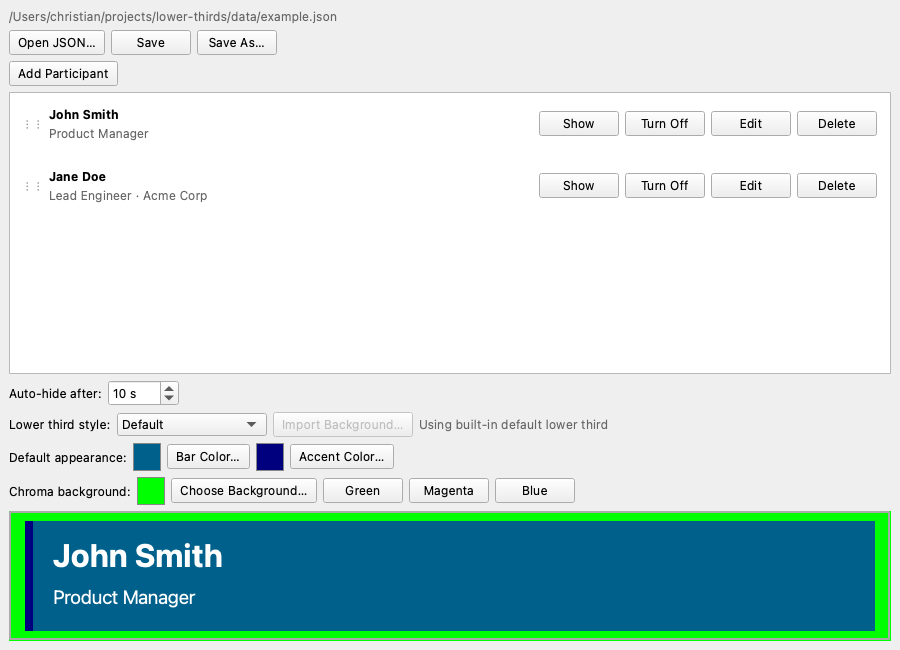

# Lower Thirds

**Version 0.1.0**

Desktop app for managing and displaying lower thirds for OBS and other capture software.

Licensed under the [GNU General Public License v3.0 or later](LICENSE).

The main window includes a chroma-key preview area at the bottom. Capture that region in OBS, apply a chroma key filter, and trigger lower thirds from the participant list.



## Run from source

Requirements:

- [uv](https://docs.astral.sh/uv/)
- Python 3.11+

```bash
git clone <repo-url>
cd lower-thirds
uv sync
uv run lower-thirds
```

Sample data is in [`data/example.json`](data/example.json). Use **Open JSON…** in the app to load it.

## OBS setup

1. Add a **Window Capture** (or Display Capture) source for the Lower Thirds window.
2. Crop to the bordered preview area at the bottom of the window.
3. Add a **Chroma Key** filter using the preview background color shown in the app (default green `#00ff00`).
4. Click **Show** on a participant to display their lower third in the preview.

Tips:

- Set **Auto-hide after** to automatically hide a lower third after N seconds (0 = stay on until you click Turn Off).
- Use **Default appearance** to change bar and accent colors, or switch to **Custom background** and import a PNG/JPG lower-third image.

## Build standalone releases

Standalone builds bundle Python, PyQt6, and the app into a folder (Linux/Windows) or `.app` bundle (macOS). **Build on each target OS** — PyQt apps cannot be cross-compiled.

The release version is defined in [`pyproject.toml`](pyproject.toml) (currently **0.1.0**). Build scripts use it for release archive names.

### Prerequisites (all platforms)

- [uv](https://docs.astral.sh/uv/)
- Python 3.11+
- Git checkout of this repository

PyInstaller is installed automatically as a dev dependency (`uv sync --dev`).

### Linux

```bash
./scripts/build.sh
```

Or manually:

```bash
uv sync --dev
uv run python scripts/build.py
```

Output:

- Bundle: `dist/lower-thirds/lower-thirds`
- Release archive: `dist/releases/lower-thirds-0.1.0-linux-<arch>.tar.gz`

Run the bundle:

```bash
./dist/lower-thirds/lower-thirds
```

Wayland and X11 Qt plugins are included via `--collect-all PyQt6` in the spec. If the app fails to start with a platform plugin error, install your distro’s Qt/XCB/Wayland runtime libraries and rebuild.

Optional: wrap the `dist/lower-thirds` folder in an [AppImage](https://appimage.org/) for a single portable file.

### Windows

Open PowerShell in the project directory:

```powershell
.\scripts\build.ps1
```

Or manually:

```powershell
uv sync --dev
uv run python scripts/build.py
```

Output:

- Bundle: `dist\lower-thirds\lower-thirds.exe`
- Release archive: `dist\releases\lower-thirds-0.1.0-windows-<arch>.zip`

Extract the zip and run `lower-thirds.exe`.

Windows SmartScreen may warn about unsigned executables until you code-sign the build.

### macOS

```bash
chmod +x scripts/build.sh
./scripts/build.sh
```

Output:

- Bundle: `dist/Lower Thirds.app`
- Release archive: `dist/releases/lower-thirds-0.1.0-macos-<arch>.zip`

Open the app from Finder or:

```bash
open "dist/Lower Thirds.app"
```

On first launch, Gatekeeper may block unsigned apps. Right-click the app → **Open**, or ad-hoc sign during development:

```bash
codesign --force --deep --sign - "dist/Lower Thirds.app"
```

For distribution outside your machine, use an Apple Developer ID and notarize the app.

## Build script options

```bash
uv run python scripts/build.py --clean        # remove old build output first
uv run python scripts/build.py --no-package   # build bundle only, skip zip/tar.gz
```

## Publish a GitHub release

1. Bump `version` in [`pyproject.toml`](pyproject.toml) (currently `0.1.0`).
2. Tag the commit: `git tag v0.1.0` (match the `v` prefix to the version in `pyproject.toml`).
3. Build on Linux, Windows, and macOS (CI or local machines).
4. Upload the three archives from `dist/releases/` to the GitHub release.
5. Attach `data/example.json` or mention it in the release notes.

Suggested release checklist:

- [ ] Version bumped in `pyproject.toml`
- [ ] Linux archive built and tested
- [ ] Windows archive built and tested
- [ ] macOS archive built and tested
- [ ] OBS capture + chroma key verified on at least one platform

## JSON format

Participant files contain settings and a participant list:

```json
{
  "settings": {
    "preview_background": "#00ff00",
    "display_duration_seconds": 5,
    "lower_third_style": "default",
    "lower_third_background": "",
    "lower_third_bar_color": "#141414",
    "lower_third_accent_color": "#e63946"
  },
  "participants": [
    {
      "id": "unique-id",
      "name": "Jane Doe",
      "title": "Lead Engineer",
      "subtitle": "Acme Corp"
    }
  ]
}
```

Bundled builds include `data/example.json` inside the app folder for reference.

## Project layout

| Path | Purpose |
|------|---------|
| `lower_thirds/` | Application source |
| `data/example.json` | Sample participant file |
| `lower-thirds.spec` | PyInstaller configuration |
| `scripts/build.py` | Cross-platform build script |
| `scripts/build.sh` | Linux/macOS build wrapper |
| `scripts/build.ps1` | Windows build wrapper |
